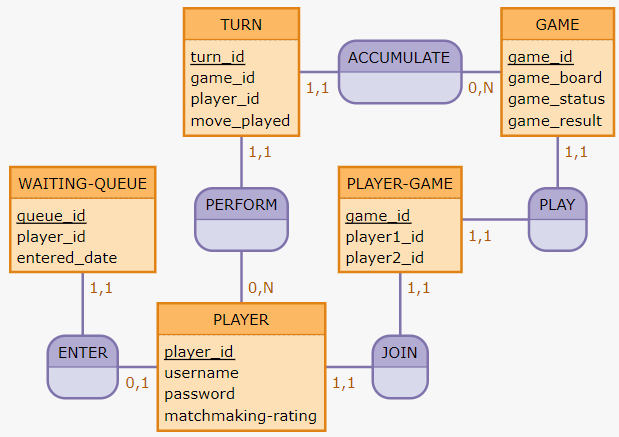
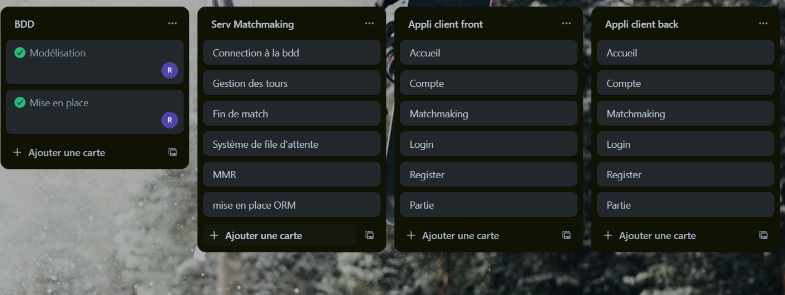

<p style="text-align:center; font-size:40px;">
Ranked tic tac toe 
</p>
<br>
<br>


# Présentation  du projet

<br>
<br>

<p style="text-align:center; font-size:25px;"> Contexte </p>

***

Ce projet s'inscrit dans le cadre du projet :  
Suivi de projet fil rouge - Dev

La problématique est la suivantes :  
> Réalisez un serveur de matchmaking pour un jeu de plateau en ligne

Les fonctionnalités demandées sont les suivantes :

```
- Modèle de données
    - Une file d'attente
        - Un moyen de communiquer avec le joueur
        - Un pseudo
        - La date

    - Des matchs
        - Un moyen de communiquer avec le joueur 1
        - Un moyen de communiquer avec le joueur 2
        - Le plateau de jeu
        - Si le match est fini
        - Si il y a eu victoire d'un joueur ou égalité

    - Des tours
        - Un lien avec le match
        - Quel joueur a joué
        - L'information du coup

- Serveur de matchmaking
    - Lien avec la base de donnée

    - Un système de socket
        - Arrivée d'un joueur en file d'attente
        - Début d'un match
        - Réception d'un tour
        - Fin d'un match

    - Une vérification de la file d'attente
    - Une logique de jeu

- Logiciel
    - Un système de socket
        - Entrée en file d'attente
        - Début du match
        - Jouer un coup
        - Prendre en compte un coup
        - Fin du match

    - Une logique de jeu
```

<p style="text-align:center; font-size:25px;"> Objectifs </p>

***

Notre but est d'accomplir un serveur de matchmaking pour un morpion en ligne tout en incluant un système de classement pour que chaque joueur rencontrent des individus plus ou moins a leur niveau.  
Nous attendons un résultat fonctionnel, fluide et efficace qui répond aux critères demandés.

<p style="text-align:center; font-size:25px;"> Résumé global </p>

***

Notre projet est un morpion en ligne comprenant un matchmaking en ligne et un système de points de classement afin de donner envie aux joueurs de jouer et gagner des places.

<br>
<br>
<br>

# Conception du projet

<br>
<br>

<p style="text-align:center; font-size:25px;"> Analyse des besoins </p>

***

Pas compris

<p style="text-align:center; font-size:25px;"> Choix techniques et outils utilisés </p>

***

### Langages  

Database -> MySQL  
Server -> JS/Node  
Website -> HTML/CSS/JS

### Logiciels

Database -> WampServer  
Server -> VisualStudioCode  
Website -> VisualStudioCode

### Autres

Database -> Prisma (peut être)

Nous avons choisis ces langages et logiciels car nous sommes à l'aise avec et savons les utiliser.

<p style="text-align:center; font-size:25px;"> Architecture du projet </p>

***

### Database MCD


### Project file tree
```
.
├── db
│   ├── database.sql
│   ├── setup.sql
│   └── MCD.png
├── Serveur
│   ├── static
│   │   ├── css
│   │   │   └── *.css
│   │   ├── font
│   │   │   └── *.ttf
│   │   ├── images
│   │   │   ├── *.png
│   │   │   └── *.jpg
│   │   └── logo
│   │       └── *.svg
│   ├── template
│   │   └── *.html
│   ├── main.js
│   ├── package-lock.json
│   └── package.json
├── .gitignore
└── project.md
```

<p style="text-align:center; font-size:25px;"> Fonctionnalités principales </p>

***

- Base de donnée
    - Avoir les tables nécessaires
    - Enregistrer les parties/coups
    
- Serveur
    - Connection des joueurs
    - Placer un joueur en file d'attente
    - Placer un joueur en partie

- Site web
    - Permettre au joueurs de se placer en file d'attente
    - Permettre au joueurs de jouer

- Client
    - Se connecter
    - S'enregistrer
    - Lancer une partie
    - Gagner des points de mmr
    - Perdre des points de mmr


<br>
<br>
<br>

# Gestion du projet

<br>
<br>

<p style="text-align:center; font-size:25px;"> Organisation de l'équipe </p>

***

Équipe  
- Fabio Vincentelli  
- Roméo Sanchez

<br>

Création de la base de donnée -> Roméo  
Mise au point du serveur -> Fabio  
Création du site web -> Roméo  

Le reste est modulable selon si un de nous a fini sa partie ou à besoin d'aide.

<p style="text-align:center; font-size:25px;"> Planification </p>

***

### Trello de notre plan


<p style="text-align:center; font-size:25px;"> Répartition des tâches </p>

***

Pour l'instant aucun problème si ce n'est le nombre de cours ou l'on peut avancer.